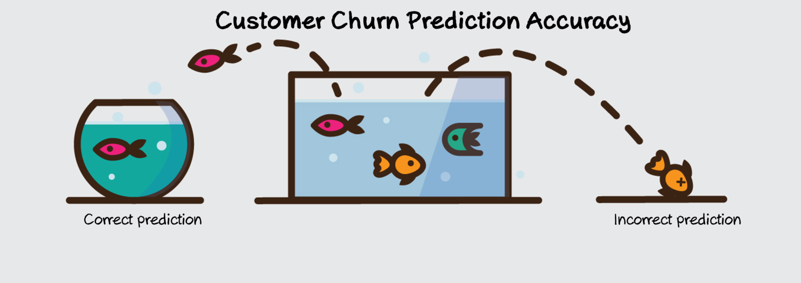

# Bank-Customer-Churn-Prediction-using-ANN: Are we losing customers?

### Problem Statement
Customer churn occurs when customers stop doing business with a company, also known as customer attrition. It is also referred to as loss of clients or customers.

  

dataset.csv contains 9,000 European Bank, EBQ customers details and judge.csv contains 1000 customers details which is unabled. The goal of this project is to predict if the customer is going to churn or not using ANN on the judge.csv dataset.This predictive analysis is vital for the EBQ bank to revise their business strategy towards customer retention. 

I have run ANN with different configurations on the same dataset and compared these models based on evaluation metrics like accuracy, precision, recall, F1-score.
